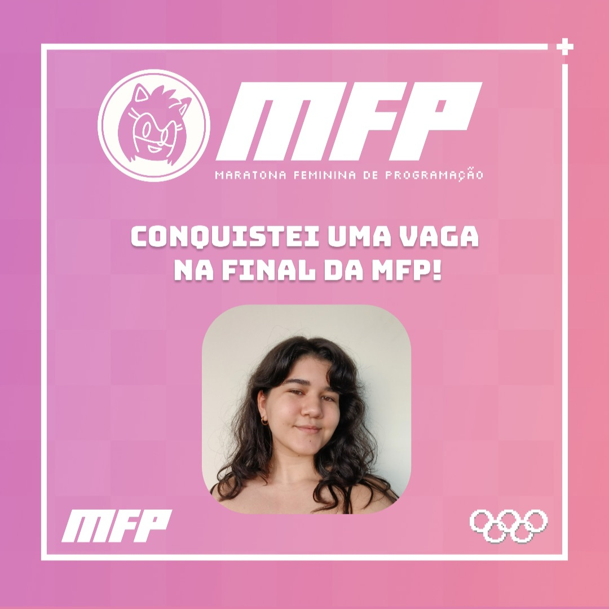
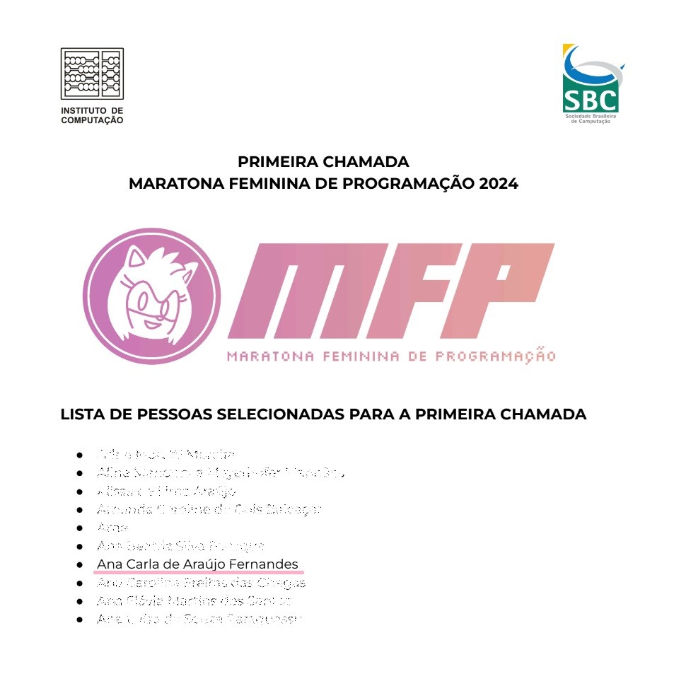

# Maratona Feminina de Programação

// Potuguês - BR

Ainda durante o nivelamento do curso de Ciência da Computação, eu soube da Maratona Feminina de Programação, uma iniciativa da Sociedade Brasileira de Computação (SBC) em parceria com o Instituto de Computação da Unicamp.

Como adoro me desafiar e já tenho algumas habilidades de programação, decidi participar pela experiência. Foi uma grande surpresa ser uma das 130 selecionadas para a fase nacional em Campinas/SP! 🎉

Nesse repositório você pode conferir meus estudos para a MFP.

// English

During the Freshman Leveling Course of my major in Computer Science, I heard about the Women's Programming Marathon (MFP), an initiative of the Brazilian Computing Society (SBC) in partnership with the Institute of Computing at Unicamp.

As I love to challenge myself and already have some programming skills, I decided to participate for the experience. It was a great surprise to be one of the 130 selected for the national phase in Campinas/SP! 🎉

In this repository, you can check out my studies for the MFP.

    

        
    

    

        
    

